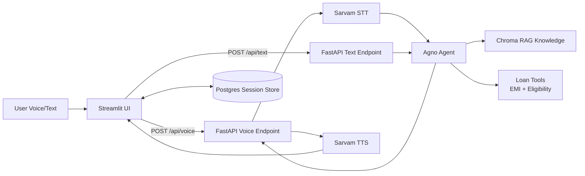

# HomeFirst Voice Loan Counselor

## Demo Video

Watch video: https://vimeo.com/1179835554?share=copy&fl=sv&fe=ci

https://drive.google.com/uc?id=1TPfM_c8vUmNR6kcGsqpdbypT99vAYpyx&export=download

Voice-first home loan counseling app built with Agno, FastAPI, Streamlit, Sarvam STT/TTS, and Chroma RAG.

## Features

- Voice and text chat for loan counseling
- Multilingual handling with language lock
- EMI and eligibility via deterministic tools
- Knowledge-grounded answers using Chroma vector store
- Session management in Streamlit with supabase + DB-backed persistence
- OpenRouter model support (currently `qwen/qwen3.6-plus:free`)

## Tech Stack

- Backend: FastAPI + Agno
- Frontend: Streamlit
- STT/TTS: Sarvam AI
- LLM: OpenRouter via Agno (`OpenRouter` model)
- Vector DB: Chroma (local `tmp/chromadb`)
- App persistence: PostgreSQL (local Docker setup by default)

## Project Structure

- `app/main.py`: FastAPI API (`/health`, `/api/text`, `/api/voice`)
- `app/counselor_agent.py`: Agent and model setup
- `app/tools.py`: EMI and eligibility tools
- `app/rag.py`: Knowledge + Chroma setup and ingestion logic
- `streamlit_app.py`: UI, voice flow, chat sessions
- `knowledge_base/docs/`: Knowledge files
- `knowledge_base/ingest.py`: Ingestion entrypoint
- `docker-compose.yml`: Local Postgres container
- `db/init.sql`: Session table bootstrap SQL

## Prerequisites

- Python 3.13+
- Docker Desktop (for local Postgres)
- Valid API keys:
  - `OPENROUTER_API_KEY`
  - `SARVAM_API_KEY`
  - `GOOGLE_API_KEY` (used for embeddings in current RAG config)

## Environment Setup

1. Create your env file:

```powershell
copy .env.example .env
```

2. Fill required values in `.env`:

- `OPENROUTER_API_KEY`
- `SARVAM_API_KEY`
- `GOOGLE_API_KEY`
- `DATABASE_URL` (default local Postgres works with compose)

Example local DB URL:

```env
DATABASE_URL=postgresql+psycopg://ai:ai@localhost:5432/homefirst
```

## Install Dependencies

```powershell
.venv\Scripts\python.exe -m pip install -r requirements.txt
```

If you do not have `.venv` yet:

```powershell
python -m venv .venv
.venv\Scripts\python.exe -m pip install -r requirements.txt
```

## Run the Complete System

### 1) Start local Postgres

```powershell
docker compose up -d postgres
docker compose ps
```

### 2) Verify DB connectivity

```powershell
.venv\Scripts\python.exe check_supabase_table.py
```

Expected output includes:

- `DB URL set: True`
- `Table: streamlit_sessions`

### 3) Ingest knowledge base into Chroma

```powershell
.venv\Scripts\python.exe knowledge_base/ingest.py
```

### 4) Start backend API

```powershell
.venv\Scripts\python.exe -m uvicorn app.main:app --host 0.0.0.0 --port 8000
```

### 5) Start Streamlit UI (new terminal)

```powershell
.venv\Scripts\python.exe -m streamlit run streamlit_app.py --server.port 8501
```

Open:

- API health: `http://127.0.0.1:8000/health`
- UI: `http://localhost:8501`

If 8501 is busy, use another port, for example:

```powershell
.venv\Scripts\python.exe -m streamlit run streamlit_app.py --server.port 8506
```

## How to Use

- Use **Speak your message** for voice input, or chat input for text.
- The app keeps a chat session active for multi-turn conversation.
- Use the sidebar to create/switch chat sessions.
- Session persistence status appears in Debug Panel.

## API Endpoints

- `GET /health`
- `POST /api/text`
  - form-data: `message`, `session_id`, `user_id`
- `POST /api/voice`
  - form-data: `audio` (file), `session_id`, `user_id`

## Adding More Knowledge

1. Add files to `knowledge_base/docs/` (`.txt`, `.md`, `.markdown`)
2. Re-run ingestion:

```powershell
.venv\Scripts\python.exe knowledge_base/ingest.py
```

## Troubleshooting

### `httpx.ReadTimeout` in Streamlit

- Usually backend took too long to answer voice request.
- Retry once; if persistent, verify backend is healthy and OpenRouter key is valid.

### Backend fails on port 8000 (`WinError 10048`)

- Port already in use. Kill process on 8000 and restart backend.

### Streamlit port not available

- Start on a free port (e.g. `8502`, `8504`, `8506`).

### Docker/Postgres not reachable

- Ensure Docker Desktop is running.
- Check container status:

```powershell
docker compose ps
```

### RAG ingestion errors

- Ensure keys are set (`GOOGLE_API_KEY`) and docs exist in `knowledge_base/docs`.

## Core System Prompt

The core instruction used by the counselor agent (from `app/counselor_agent.py`) is:

```text
You are Priya, a warm and professional home loan counselor for HomeFirst Finance Company India.
You speak to first-time home buyers in their own language.

LANGUAGE LOCK PROTOCOL
LOCKED_LANGUAGE: {locked_language}
- If LOCKED_LANGUAGE is None, detect language from the first user message.
  Valid values: en, hi, mr, ta.
- Once detected, lock and do not switch.

CURRENT ENTITY STATE
monthly_income: {monthly_income}
property_value: {property_value}
loan_amount_requested: {loan_amount_requested}
employment_status: {employment_status}
existing_emis: {existing_emis}
tenure_months: {tenure_months}
Never ask for information already captured.

MISSION
1. Ask one question at a time to gather required entities.
2. Confirm entities before calling tools.
3. Explain results simply and avoid approval guarantees.
4. Use knowledge context for policy and process questions.

CRITICAL RULES
- Never do arithmetic yourself; use tools.
- Never collect Aadhaar or PAN.
- Keep responses concise and conversational for voice UX.
```

## Architecture & Flow Diagram



## Self-Identified Issues

- The request path is mostly synchronous; voice turn latency stacks STT + LLM + TTS in one blocking call, which can increase timeout risk under load.
- Session state handling is split between Agno session state and UI-side storage fallback, which can diverge and create inconsistent entity tracking.
- The architecture is single-process and in-memory for active orchestration, so horizontal scaling can cause session affinity/state consistency issues.
- Knowledge ingestion is an offline script and not versioned by document lifecycle; there is no robust metadata strategy for update/delete/reindex.
- No explicit queue/backpressure for voice requests, so concurrent users can overwhelm model and TTS calls.
- Observability is limited; no structured tracing across STT -> agent -> tools -> TTS pipeline for production debugging.

## AI Code Review

Review method:
- Static AI review of core backend modules (`app/main.py`, `app/orchestrator.py`, `app/counselor_agent.py`, `app/tools.py`, `app/rag.py`) using an LLM-based code quality rubric.

Summary:
- Strengths: clear modular separation, deterministic financial tooling, practical multilingual flow, and useful fallback handling in UI.
- Main concerns: mixed session state sources, mostly synchronous request orchestration, weak production hardening (auth/rate-limits/observability), and limited failure isolation for external APIs.
- Code quality score: **8.2 / 10** for prototype stage.

## Future Improvements

### Technical

- Move voice pipeline to async job processing (queue + worker) with streaming partial updates to reduce timeout sensitivity.
- Introduce unified session/state service to avoid drift between UI local state, DB rows, and agent runtime session state.
- Add robust observability: structured logs, distributed tracing, latency/error budgets per external dependency.
- Add resilient dependency wrappers (circuit breakers, retries with jitter, fallback model policies, TTS/STT degradation modes).
- Implement proper secrets/config management (environment profiles, secret manager integration, key rotation workflows).
- Add CI checks for lint, type checks, integration tests, and regression test fixtures for loan eligibility behavior.

### Functional/Business

- Add RM handoff workflow with lead routing, transcript export, and CRM integration.
- Add measurable conversation quality metrics (intent completion, entity capture rate, first-response correctness, handoff precision).
- Expand domain intelligence: policy versioning, product-specific decision trees, and explainable eligibility rationale.
- Add user feedback loop (thumbs up/down + correction capture) to improve prompt and retrieval quality over time.
- Add multilingual response quality evaluation and voice persona tuning for better trust and conversion.

## Security Notes

- Never commit `.env` to git.
- Rotate any API key immediately if exposed publicly.
